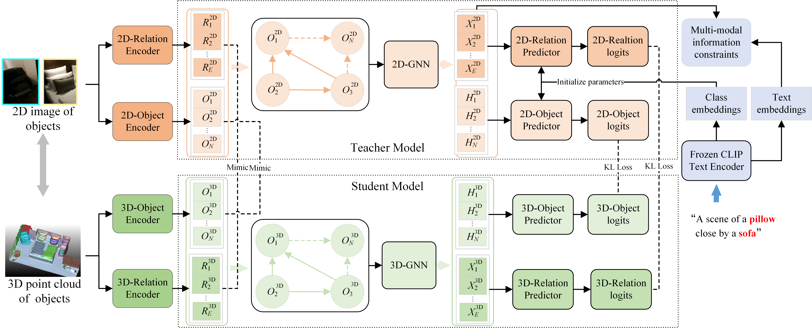

# ViTex3D: Integrating Visual and Textual Features for Robust Semantic 3D Indoor Scene Graph Predictions from Point Clouds

ViTex3D: Integrating Visual and Textual Features for Robust Semantic 3D Indoor Scene Graph Predictions from Point Clouds), Submitted to ISPRS Journal of Photogrammetry and Remote Sensing, 2024 (The source code will be released later)

  

This paper introduces the ViTex3D framework for predicting 3D indoor scene graphs from point clouds. This innovative framework incorporates multimodal generalized features from large visual and textual models to enhance node representation, feature transmission, and loss construction processes in the 3D point cloud scene graph prediction model. Consequently, it improves the model's generalization performance and its ability to recognize long-tail semantics. First, in the graph structure initialization phase, the integration of 2D images, 3D point clouds, and textual descriptions enhances the representation of nodes and edges in the scene graph prediction model. Next, a novel graph attention network with a mixed relation-object perception mechanism is devised as the backbone for graph reasoning, enhancing the model's capacity to capture correlations between objects and relations. Finally, in the model training phase, the integration of object classification loss, relationship prediction loss, and alignment loss between textual descriptions and triplets constructs a multi-loss objective function. To validate the effectiveness of the proposed 3D scene graph prediction  method, the 3RScan dataset was used for experimental evaluation. Ablation studies were conducted on feature representation, graph model, and loss function improvements. Additionally, comparisons were made with state-of-the-art (SOTA) methods. The results demonstrate that the proposed method significantly outperforms SOTA methods in object, predicate, and triplet prediction, particularly improving prediction accuracy for long-tail labels.

## Data Preparation
We utilize a 3D semantic scene graph dataset derived from the 3RScan dataset, encompassing 1,553 3D reconstructed indoor scenes, 160 object categories, and 26 relation categories. In our experimental setup, we adhere to the same data processing protocol and the division of the training and test sets as outlined in VLSAT.

## Experimental Results

Results of the 3RScan Datasets

  

## License

This project is licensed under the Apache 2.0 License - see the [LICENSE](LICENSE) file for details.
